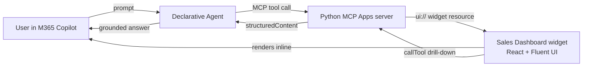
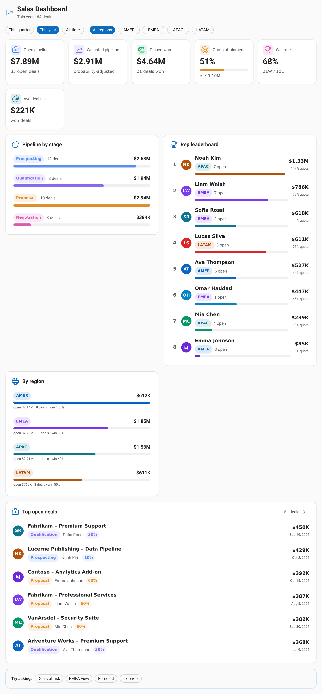
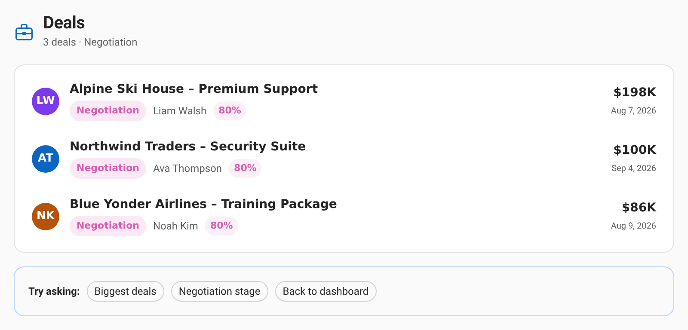
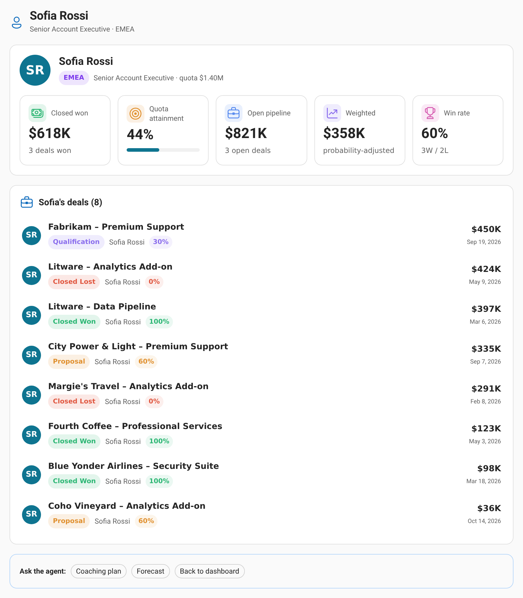
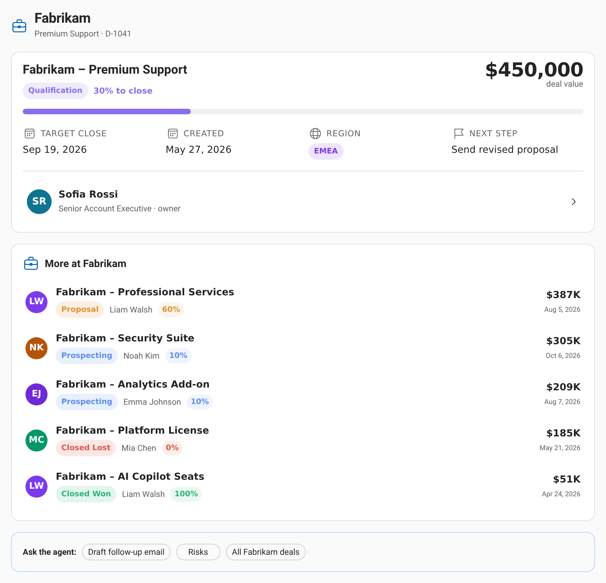

# Sales Dashboard — Declarative M365 Copilot Agent + MCP Apps server

A **declarative agent for Microsoft 365 Copilot** backed by an **MCP Apps** server
(written in Python) that provides both the **data services** and a **rich,
interactive sales dashboard UI** rendered inline in Copilot chat.

Ask the agent questions in natural language — *"show me the sales dashboard"*,
*"which late-stage deals are at risk?"*, *"how is Sofia performing?"* — and it
calls MCP tools that return data **and** a React/Fluent UI widget that renders
directly in the conversation. Click into deals, reps, stages and regions; the
widget calls back into the same MCP tools to drill down.

> **New here? Follow the [step-by-step guide](docs/GUIDE.md)** — a complete
> walkthrough from an empty folder to a working agent in Copilot, plus
> production authentication, marketplace publishing, and troubleshooting.
>
> **Designing your own?** The [design guide](docs/DESIGN_GUIDE.md) is a repeatable
> process — from business KPIs and metrics, through UI and tool design, to the
> interaction model (silent drill-down vs. conversation vs. context updates),
> context-aware operations, and authentication.



## See it in action

Ask in plain language and the agent calls an MCP tool that returns both a grounded
answer **and** a live, interactive dashboard rendered inline in Copilot chat.

> 💬 *"Show me the sales dashboard"*



### Intelligent, conversational drill-downs

The agent understands follow-up questions, and every click calls back into the same
MCP tools — so the conversation and the UI stay in sync. No dashboards to configure,
just ask.

| 💬 *"Which late-stage deals are at risk?"* |
| :-- |
|  |

| 💬 *"How is Sofia performing?"* | 💬 *"Open the Fabrikam – Premium Support deal"* |
| :-- | :-- |
|  |  |

What makes it *intelligent*:

* **Natural-language understanding** — free-form questions map to the right tool and
  filters (period, region, stage, rep, amount, search).
* **Grounded answers** — each tool returns a short text summary Copilot reads aloud,
  alongside the structured data behind the widget.
* **Interactive follow-through** — clicking a deal, rep, stage or region calls the MCP
  tools again to drill down, and the "Try asking" chips seed the next question.
* **Quick facts without a widget** — `get_sales_summary` returns data only for answers
  like *"what's our win rate in EMEA?"*.

> The screenshots above are rendered from the actual widget
> (`server/sales_mcp/web/widget.html`) using the demo dataset in
> `server/sales_mcp/data.py`.

## How it works (MCP Apps)

* Each MCP **tool** (`show_sales_dashboard`, `list_deals`, `show_deal_details`,
  `show_rep_details`) is linked to a UI **resource** through
  `_meta.ui.resourceUri` (the MCP Apps convention). When Copilot calls the tool,
  it renders the widget inline and hands it the tool's `structuredContent`.
* The widget is a single self-contained HTML file (React + Fluent UI v9, built
  with Vite) served as the `ui://sales-dashboard/app.html` resource with MIME
  type `text/html;profile=mcp-app`.
* One tool (`get_sales_summary`) returns **data only** (no widget) for quick
  factual answers.
* The widget talks to the host via `@modelcontextprotocol/ext-apps` and also
  falls back to the OpenAI Apps SDK (`window.openai`) bridge, so it works in
  M365 Copilot and ChatGPT-style hosts.

## Project structure

```
mcp_app/
├── server/                       # Python MCP Apps server (uv project)
│   ├── sales_mcp/
│   │   ├── server.py             # FastMCP bootstrap, resource + tool registration
│   │   ├── tools.py              # tool handlers + TOOL_SPECS / PROMPT_SPECS
│   │   ├── analytics.py          # KPI / aggregation logic
│   │   ├── data.py               # in-memory demo dataset (reps, deals)
│   │   ├── settings.py           # env-driven config
│   │   └── web/widget.html       # built widget (generated by the widgets build)
│   ├── scripts/
│   │   ├── smoke_test.py         # end-to-end MCP client test
│   │   ├── gen_ai_plugin.py      # regenerate appPackage/ai-plugin.json from the server
│   │   └── make_icons.py         # generate the Teams app icons
│   └── pyproject.toml
├── widgets/                      # React + Fluent UI widget (Vite single-file build)
│   ├── src/
│   │   ├── App.tsx               # view router (dashboard / deals / deal / rep)
│   │   ├── views/                # Dashboard, DealsList, DealDetail, RepDetail
│   │   ├── components/           # shared UI + deal row
│   │   ├── mcp/McpBridge.tsx     # MCP Apps <-> React bridge
│   │   └── types.ts, format.ts, theme.ts, devMock.ts
│   └── build.mjs                 # builds to ../server/sales_mcp/web/widget.html
├── appPackage/                   # Declarative agent package
│   ├── manifest.json             # Teams app manifest (declarativeAgents)
│   ├── declarativeAgent.json     # agent name, instructions, conversation starters
│   ├── ai-plugin.json            # MCP plugin manifest (RemoteMCPServer runtime)
│   ├── instruction.txt           # agent system instructions
│   └── color.png / outline.png   # icons
├── env/.env.dev                  # ATK environment (set MCP_ENDPOINT_URL here)
└── m365agents.yml                # ATK lifecycle (provision / publish)
```

## Prerequisites

* Python 3.11+ and [uv](https://docs.astral.sh/uv/)
* Node.js 18+ and npm
* [Microsoft 365 Agents Toolkit CLI](https://aka.ms/M365AgentsToolkit) — `atk` > 1.1.5-beta
* A Microsoft 365 tenant with **custom app upload** and **Copilot** enabled (for provisioning)
* A tunneling tool to expose the local server (e.g. [dev tunnels](https://learn.microsoft.com/azure/developer/dev-tunnels/get-started))

## 1) Build the widget

```bash
cd widgets
npm install
npm run build          # → server/sales_mcp/web/widget.html
```

During UI development you can run `npm run dev` (http://localhost:5174) to preview
the dashboard with mock data.

## 2) Run the MCP server

```bash
cd server
uv run python -m sales_mcp     # → http://localhost:3978/mcp
```

## 3) Test locally

```bash
# From server/ — end-to-end client test (lists tools, calls them, reads the widget):
uv run python scripts/smoke_test.py

# Or open the MCP Inspector in a browser:
npx @modelcontextprotocol/inspector
#   Transport: Streamable HTTP   URL: http://localhost:3978/mcp
```

## 4) Connect it to Microsoft 365 Copilot

The MCP server must be reachable over HTTPS. Expose it with a dev tunnel:

```bash
# install once: curl -sL https://aka.ms/DevTunnelCliInstall | bash
devtunnel user login
devtunnel host -p 3978 --allow-anonymous
# copy the public https URL, e.g. https://abc123-3978.usw2.devtunnels.ms
```

Set the endpoint in `env/.env.dev` (note the `/mcp` suffix):

```
MCP_ENDPOINT_URL=https://abc123-3978.usw2.devtunnels.ms/mcp
```

Then sign in and provision (sideloads the agent into your tenant):

```bash
atk auth login m365      # confirm "Custom App Upload" and "Copilot Access" are enabled
atk provision --env dev
```

Open <https://m365.cloud.microsoft/chat>, pick **Sales Dashboard** from the agent
list, and try a conversation starter such as *"Show me the sales dashboard"*.

> If you change the server's tools, regenerate the plugin manifest:
> `cd server && uv run python scripts/gen_ai_plugin.py`

### Alternative: manual sideload (when CLI sign-in is blocked)

If `atk auth login m365` is blocked by tenant policy (e.g. `AADSTS500014`
disabled service principal, or `AADSTS530084` Conditional Access token
protection), build the package offline and upload it through the browser instead:

```bash
# Set a stable app id once (any GUID), keep MCP_ENDPOINT_URL set in env/.env.dev:
#   TEAMS_APP_ID=<your-guid>
atk package --env dev          # → appPackage/build/appPackage.dev.zip
```

Then upload `appPackage/build/appPackage.dev.zip`:

* **Microsoft 365 Copilot** → <https://m365.cloud.microsoft/chat> → **Agents** →
  **Build an agent / Upload custom agent**, or
* **Microsoft Teams** → **Apps** → **Manage your apps** → **Upload a custom app**.

Manual upload uses your existing signed-in browser session, which typically
satisfies Conditional Access policies that block the CLI's embedded sign-in.
The dev tunnel and the MCP server must stay running while you use the agent.

## Tools

| Tool | UI | Description |
|------|----|-------------|
| `show_sales_dashboard` | ✅ | KPIs, pipeline by stage, top deals, rep leaderboard, regions. Filters: `period`, `region`. |
| `list_deals` | ✅ | Filtered deal list. Filters: `stage`, `region`, `rep`, `min_amount`, `search`. |
| `show_deal_details` | ✅ | Single deal detail + sibling deals. Requires `deal_id`. |
| `show_rep_details` | ✅ | Single rep scorecard + their deals. Requires `rep`. |
| `get_sales_summary` | — | Headline metrics as data only (for quick text answers). |

## Notes

* The dataset is generated in-memory (`server/sales_mcp/data.py`) for demo
  purposes — swap it for your CRM / warehouse by editing `data.py` and
  `analytics.py`.
* Authentication is anonymous for local development. For production, configure
  OAuth 2.1 or Microsoft Entra SSO on the MCP server and in `ai-plugin.json`.
* References: [MCP Apps in Copilot](https://learn.microsoft.com/microsoft-365/copilot/extensibility/plugin-mcp-apps),
  [Plugins for M365 Copilot](https://learn.microsoft.com/microsoft-365/copilot/extensibility/overview-plugins?tabs=mcp),
  [interactive UI samples](https://github.com/microsoft/mcp-interactiveUI-samples).
