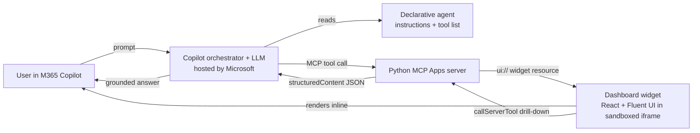
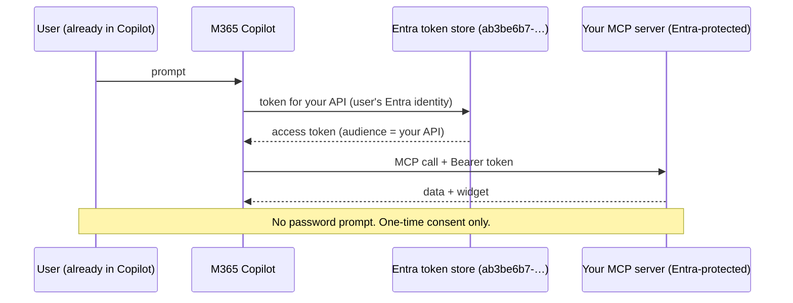
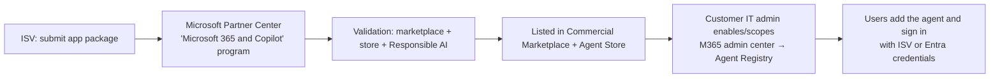

# Step-by-Step Guide — Sales Dashboard Declarative Agent (MCP Apps)

A complete, reproducible walkthrough for building a **declarative agent for
Microsoft 365 Copilot** that is backed by a **Python MCP Apps server** providing
both the **data services** and a **rich, interactive dashboard UI** rendered
inline in Copilot chat.

This guide is self-contained — follow it top to bottom to go from an empty
folder to a working agent in Copilot, then (optionally) production auth and
marketplace publishing.

---

## Table of contents

1. [What you are building](#1-what-you-are-building)
2. [How it works (architecture)](#2-how-it-works-architecture)
3. [Prerequisites](#3-prerequisites)
4. [Project layout](#4-project-layout)
5. [Step A — The MCP server (data services)](#step-a--the-mcp-server-data-services)
6. [Step B — The dashboard widget (rich UI)](#step-b--the-dashboard-widget-rich-ui)
7. [Step C — Run & test locally](#step-c--run--test-locally)
8. [Step D — The declarative agent package](#step-d--the-declarative-agent-package)
9. [Step E — Expose the server (dev tunnel)](#step-e--expose-the-server-dev-tunnel)
10. [Step F — Sideload into Microsoft 365 Copilot](#step-f--sideload-into-microsoft-365-copilot)
11. [Authentication for production](#authentication-for-production)
12. [Publishing to the Microsoft 365 Agent Store (ISV)](#publishing-to-the-microsoft-365-agent-store-isv)
13. [Which LLM runs the agent?](#which-llm-runs-the-agent)
14. [MCP Apps vs. Adaptive Cards](#mcp-apps-vs-adaptive-cards)
15. [Troubleshooting](#troubleshooting)

---

## 1. What you are building

A declarative agent that answers natural-language sales questions — *"show me
the sales dashboard"*, *"which late-stage deals are at risk?"*, *"how is Sofia
performing?"* — by calling MCP tools that return **data** and an interactive
**React/Fluent UI dashboard**. Users click into deals, reps, stages and regions;
the widget calls back into the same MCP tools to drill down.

| Capability | Tool | Renders UI |
|---|---|---|
| KPIs, pipeline funnel, leaderboard, regions | `show_sales_dashboard` | ✅ |
| Filtered deal list | `list_deals` | ✅ |
| Single deal detail + siblings | `show_deal_details` | ✅ |
| Single rep scorecard | `show_rep_details` | ✅ |
| Headline metrics as data only | `get_sales_summary` | — |

---

## 2. How it works (architecture)



Key ideas:

- **MCP Apps** links each tool to a UI **resource** via `_meta.ui.resourceUri`.
  When Copilot calls the tool, it renders the linked widget inline and hands it
  the tool's `structuredContent`.
- The widget is a single self-contained HTML file (React 18 + Fluent UI v9,
  built with Vite), served as `ui://sales-dashboard/app.html` with MIME type
  `text/html;profile=mcp-app`.
- The agent package contains **no model and no server code** — only
  configuration (instructions, tool list) and a **pointer (URL)** to the MCP
  server.

---

## 3. Prerequisites

| Tool | Version | Notes |
|---|---|---|
| Python | 3.11+ | The MCP server |
| [uv](https://docs.astral.sh/uv/) | latest | Python env/runner |
| Node.js | 18+ | Widget build |
| [Microsoft 365 Agents Toolkit CLI](https://aka.ms/M365AgentsToolkit) (`atk`) | > 1.1.5-beta | `npm i -g @microsoft/m365agentstoolkit-cli@beta` |
| [Dev tunnels CLI](https://learn.microsoft.com/azure/developer/dev-tunnels/get-started) (`devtunnel`) | latest | Expose local server over HTTPS |
| M365 tenant | — | **Custom app upload** + **Copilot** enabled (for sideloading) |

Verify:

```bash
python3 --version && uv --version && node --version && atk --version
```

---

## 4. Project layout

```
mcp_app/
├── server/                       # Python MCP Apps server (uv project)
│   ├── sales_mcp/
│   │   ├── server.py             # FastMCP bootstrap, resource + tool registration
│   │   ├── tools.py              # tool handlers + TOOL_SPECS / PROMPT_SPECS
│   │   ├── analytics.py          # KPI / aggregation logic
│   │   ├── data.py               # in-memory demo dataset (reps, deals)
│   │   ├── settings.py           # env-driven config (SALES_MCP_*)
│   │   └── web/widget.html       # built widget (generated by the widgets build)
│   ├── scripts/
│   │   ├── smoke_test.py         # end-to-end MCP client test
│   │   ├── gen_ai_plugin.py      # regenerate appPackage/ai-plugin.json from the server
│   │   └── make_icons.py         # generate the Teams app icons
│   └── pyproject.toml
├── widgets/                      # React + Fluent UI widget (Vite single-file build)
│   ├── src/
│   │   ├── App.tsx               # view router (dashboard / deals / deal / rep)
│   │   ├── views/                # Dashboard, DealsList, DealDetail, RepDetail
│   │   ├── components/           # shared UI + deal row
│   │   ├── mcp/McpBridge.tsx     # MCP Apps <-> React bridge
│   │   └── types.ts, format.ts, theme.ts, devMock.ts
│   └── build.mjs                 # builds to ../server/sales_mcp/web/widget.html
├── appPackage/                   # Declarative agent package
│   ├── manifest.json             # Teams app manifest (declarativeAgents)
│   ├── declarativeAgent.json     # agent name, instructions, conversation starters
│   ├── ai-plugin.json            # MCP plugin manifest (RemoteMCPServer runtime)
│   ├── instruction.txt           # agent system instructions
│   └── color.png / outline.png   # icons
├── env/.env.dev                  # ATK environment (set MCP_ENDPOINT_URL + TEAMS_APP_ID)
└── m365agents.yml                # ATK lifecycle (provision / publish)
```

---

## Step A — The MCP server (data services)

The server uses `FastMCP` (from the `mcp` Python SDK). Three moving parts:

**1. Register the widget as a UI resource** ([server/sales_mcp/server.py](../server/sales_mcp/server.py)):

```python
WIDGET_URI = "ui://sales-dashboard/app.html"

@mcp.resource(WIDGET_URI, mime_type="text/html;profile=mcp-app")
async def sales_dashboard_widget() -> str:
    return _load_widget_html()
```

**2. Register tools, linking UI tools to the resource** via `meta`:

```python
for spec in TOOL_SPECS:
    kwargs = {"name": spec["name"], "description": spec["description"]}
    if spec.get("ui", True):
        kwargs["meta"] = {"ui": {"resourceUri": WIDGET_URI}}   # ← the MCP Apps link
    mcp.tool(**kwargs)(spec["handler"])
```

**3. Each tool returns `structuredContent`** the widget renders
([server/sales_mcp/tools.py](../server/sales_mcp/tools.py)). A `view`
discriminator (`dashboard | deals | deal | rep | summary | error`) lets the
single widget route:

```python
return types.CallToolResult(
    content=[types.TextContent(type="text", text=summary_text)],  # Copilot reads this
    structuredContent={"view": "dashboard", **data},               # the widget renders this
)
```

Install and smoke-check imports:

```bash
cd server
uv run python -c "from sales_mcp import server, tools, analytics; print('ok')"
```

> Swap the demo data for your CRM/warehouse by editing
> [server/sales_mcp/data.py](../server/sales_mcp/data.py) and
> [server/sales_mcp/analytics.py](../server/sales_mcp/analytics.py). The tool and
> widget contracts stay the same.

---

## Step B — The dashboard widget (rich UI)

The widget is real HTML/CSS/JS (React + Fluent UI), **not** an Adaptive Card.

- [widgets/src/mcp/McpBridge.tsx](../widgets/src/mcp/McpBridge.tsx) wraps
  `@modelcontextprotocol/ext-apps` — it receives tool results
  (`app.ontoolresult → structuredContent`), reads the host theme, toggles
  full-screen, and exposes `callTool` for drill-downs. It also falls back to the
  OpenAI Apps SDK (`window.openai`) so the widget works in ChatGPT-style hosts.
- [widgets/src/App.tsx](../widgets/src/App.tsx) routes on `data.view`.
- [widgets/build.mjs](../widgets/build.mjs) bundles everything into one
  self-contained HTML file and writes it to
  `server/sales_mcp/web/widget.html`. A `strip-crossorigin` step removes the
  `crossorigin` attribute (sandboxed iframes load from a null origin).

Build it:

```bash
cd widgets
npm install
npm run build        # → server/sales_mcp/web/widget.html
```

Preview with mock data during UI work (no MCP host needed):

```bash
npm run dev          # http://localhost:5174
```

---

## Step C — Run & test locally

Start the server (default port **3978**):

```bash
cd server
uv run python -m sales_mcp           # → http://localhost:3978/mcp
```

Test end-to-end with the included client (lists tools, calls each, reads the
widget resource):

```bash
# in another terminal, from server/
uv run python scripts/smoke_test.py
```

Expected: 5 tools (4 with `ui` meta), 1 resource
(`ui://sales-dashboard/app.html`, `text/html;profile=mcp-app`), and real KPI
numbers in the dashboard payload.

Or use the visual **MCP Inspector**:

```bash
npx @modelcontextprotocol/inspector
#   Transport: Streamable HTTP   URL: http://localhost:3978/mcp
```

---

## Step D — The declarative agent package

Three manifests reference each other; the last hop is the MCP endpoint:

```
manifest.json  →  declarativeAgent.json  →  ai-plugin.json  →  MCP server URL
```

- [appPackage/manifest.json](../appPackage/manifest.json) — Teams app manifest;
  `copilotAgents.declarativeAgents` points to `declarativeAgent.json`.
- [appPackage/declarativeAgent.json](../appPackage/declarativeAgent.json) — agent
  name, `instructions` (`$[file('instruction.txt')]`), conversation starters,
  and `actions` → `ai-plugin.json`.
- [appPackage/ai-plugin.json](../appPackage/ai-plugin.json) — the MCP plugin
  manifest. The `runtimes` block is where the MCP server is wired:

```jsonc
"runtimes": [{
  "type": "RemoteMCPServer",
  "spec": {
    "url": "${{MCP_ENDPOINT_URL}}",                 // ← token, substituted at package time
    "x-mcp_tool_description": { "tools": [ /* cached schemas + _meta.ui links */ ] }
  },
  "run_for_functions": [ "show_sales_dashboard", ... ],
  "auth": { "type": "None" }                          // anonymous (dev only)
}]
```

Keep the cached tool schemas in sync with the server (run with the server up):

```bash
cd server
uv run python scripts/gen_ai_plugin.py     # rewrites appPackage/ai-plugin.json
```

Generate the icons once:

```bash
python3 server/scripts/make_icons.py       # appPackage/color.png + outline.png
```

Set a stable app id and the endpoint in [env/.env.dev](../env/.env.dev):

```bash
TEAMS_APP_ID=<a-guid>           # python3 -c "import uuid; print(uuid.uuid4())"
MCP_ENDPOINT_URL=               # filled in Step E
```

---

## Step E — Expose the server (dev tunnel)

Copilot must reach your server over HTTPS. Tunnel the local port:

```bash
# install once (no sudo): downloads the binary to ~/bin
mkdir -p ~/bin
curl -sL https://aka.ms/TunnelsCliDownload/linux-x64 -o ~/bin/devtunnel
chmod +x ~/bin/devtunnel

~/bin/devtunnel user login                       # device-code or browser
~/bin/devtunnel host -p 3978 --allow-anonymous --protocol http
# copy the public URL, e.g. https://<id>-3978.<region>.devtunnels.ms
```

Put the `/mcp` URL into [env/.env.dev](../env/.env.dev):

```
MCP_ENDPOINT_URL=https://<id>-3978.<region>.devtunnels.ms/mcp
```

Verify the tunnel reaches your server:

```bash
curl -s -X POST "$MCP_ENDPOINT_URL" \
  -H "Content-Type: application/json" \
  -H "Accept: application/json, text/event-stream" \
  -d '{"jsonrpc":"2.0","id":1,"method":"initialize","params":{"protocolVersion":"2025-06-18","capabilities":{},"clientInfo":{"name":"curl","version":"1.0"}}}'
# expect: "serverInfo":{"name":"sales-dashboard", ...}
```

> **Keep the server and tunnel running** the whole time you use the agent — the
> package only stores a pointer to this URL.

---

## Step F — Sideload into Microsoft 365 Copilot

### Option 1 — Agents Toolkit (automated)

```bash
atk auth login m365        # confirm "Custom App Upload" + "Copilot Access" are enabled
atk provision --env dev    # registers the app and sideloads it into your tenant
```

Then open <https://m365.cloud.microsoft/chat>, pick **Sales Dashboard**, and try
*"Show me the sales dashboard"*.

### Option 2 — Manual upload (when CLI sign-in is blocked)

If `atk auth login m365` is blocked by tenant policy (see
[Troubleshooting](#troubleshooting)), build the package offline and upload it
through the browser, which uses your existing signed-in session:

```bash
atk package --env dev      # → appPackage/build/appPackage.dev.zip
```

Upload `appPackage/build/appPackage.dev.zip` via:

- **Copilot** → <https://m365.cloud.microsoft/chat> → **Agents** → **Build / upload custom agent**, or
- **Teams** → **Apps** → **Manage your apps** → **Upload a custom app**.

Because the app id is fixed in `env/.env.dev`, re-uploading **updates** the same
agent instead of creating a duplicate.

---

## Authentication for production

The dev setup uses `auth: { "type": "None" }`. For production, use one of the
two MCP-supported schemes. Both are configured in the `auth` block of
[appPackage/ai-plugin.json](../appPackage/ai-plugin.json) and validated by your
server.

### Microsoft Entra ID SSO — seamless, customer's identity

Best when the data belongs to the **customer's** tenant. Users are **already**
signed into Copilot, so there is **no extra login** — at most a one-time
consent (admin can pre-grant it tenant-wide).



Setup (summary):

1. **Teams Developer Portal** → *Microsoft Entra SSO client ID registration* →
   base URL = your server URL, client ID = your Entra app. Generates an **SSO
   registration ID** + an **Application ID URI**.
2. **Entra app registration**: add that Application ID URI to `identifierUris`;
   add redirect URI `https://teams.microsoft.com/api/platform/v1.0/oAuthConsentRedirect`;
   under *Expose an API*, authorize the token-store client
   `ab3be6b7-f5df-413d-ac2d-abf1e3fd9c0b`.
3. **Manifest**: `"auth": { "type": "OAuthPluginVault", "reference_id": "<SSO registration ID>" }`.
4. **Server**: validate the bearer token — issuer, **audience = your Application
   ID URI**, and allow the token-store client id. Use the on-behalf-of flow if
   you must call a downstream API as the user (return `401` to trigger consent).

> **Same tenant vs. cross-tenant:** cross-tenant is a strict superset (it also
> needs a **multi-tenant** Entra app + consent in the consuming tenant). If you
> build it cross-tenant-ready with **config-driven issuer/audience validation**,
> the same code serves same-tenant by flipping the app to single-tenant — no
> rewrite. Whether a guest user (e.g. a home-tenant identity invited into
> another tenant) is "same" or "cross" depends on **where Copilot runs vs. where
> the server's Entra app is registered**, not on which user signs in.

### OAuth 2.0 authorization code flow — ISV-owned credentials

Best when **you (the ISV)** own the user accounts (a SaaS product). Users sign
in to **your** identity provider the first time, then tokens are cached.

1. **Teams Developer Portal** → *OAuth client registration* → your auth server's
   Client ID/secret, **authorization / token / refresh** endpoints, scope,
   optional PKCE. Generates an **OAuth client registration ID**. Your provider
   must allow redirect `https://teams.microsoft.com/api/platform/v1.0/oAuthRedirect`.
2. **Manifest**: `"auth": { "type": "OAuthPluginVault", "reference_id": "<OAuth client registration ID>" }`.
3. **Server**: validate the bearer token issued by **your** auth server.

Limits: authorization-code flow only; token endpoints returning `307` aren't
supported; MCP plugins don't support API-key auth; users can't self-clear stored
tokens (implement server-side sign-out to force re-auth).

---

## Publishing to the Microsoft 365 Agent Store (ISV)

The same app package is the marketable unit. The ISV → many-customers flow:



- **Publish:** submit `appPackage.zip` via **Microsoft Partner Center** →
  *Microsoft 365 and Copilot* program (offer type *Apps and agents for Microsoft
  365 and Copilot*). Requires a **multi-tenant** offering and passing
  certification + Responsible AI validation.
- **Admin control:** customer admins **enable, disable, assign, block** the
  agent in the **Microsoft 365 admin center → Agent Registry**. Users only see
  agents the admin allowed.
- **One registration, all tenants:** the ISV registers the OAuth/SSO client
  **once**; the `reference_id` ships inside the package. Microsoft's token store
  isolates each user's token, so the ISV maps each user to its own
  accounts/entitlements.

---

## Which LLM runs the agent?

A **declarative** agent has **no model of its own** and **no model field** in its
manifest. It runs on Microsoft 365 Copilot's **built-in, Microsoft-hosted model**
(the current GPT-class orchestrator model), which you cannot pin or swap. Your
MCP server contributes **data + UI only** — zero inference.

You shape behavior through [appPackage/instruction.txt](../appPackage/instruction.txt)
(the system prompt) and tool descriptions — not by choosing a model.

> Need to choose the model (e.g. a specific Azure OpenAI deployment)? That's a
> **custom engine agent** — you bring and host your own LLM + orchestration
> (typically on Azure) and surface it in Copilot/Teams. Same MCP server and
> dashboard, plus an orchestration layer you own.

---

## MCP Apps vs. Adaptive Cards

| | **MCP App widget (this project)** | **Adaptive Card** |
|---|---|---|
| Format | Real HTML/CSS/JS in a sandboxed iframe | Declarative JSON schema |
| Interactivity | Full — stateful, drill-downs, `callTool` | `Input.*` + `Action.*` only |
| Libraries | Any (React, Fluent, charts, maps) | None (fixed element set) |
| Hosting | Needs a running MCP server | Serverless (inline JSON) |
| Reach | Copilot/ChatGPT MCP-Apps hosts (newer) | Broad (Teams, Outlook, bots, older) |
| Weight | Heavier (web bundle) | Very light |

Use a **widget** for genuinely interactive/visual experiences (dashboards,
editors, maps). Use an **Adaptive Card** for lightweight, host-native,
serverless presentation. They are complementary.

---

## Troubleshooting

| Symptom | Cause & fix |
|---|---|
| Widget shows "not built yet" | Run `cd widgets && npm run build`, then restart the server. |
| `AADSTS500014` on `atk auth login m365` | The tenant's Teams/Copilot service principal is disabled (lapsed subscription). Use a different tenant. |
| `AADSTS530084` + "localhost refused to connect" | Conditional Access *token protection* blocks the CLI's sign-in (the localhost redirect listener closes after the auth error). Use **manual upload** (Step F, Option 2). |
| Agent loads but tools fail | The server or tunnel is down, or the tunnel URL changed. Restart both; if the URL changed, re-run `atk package` and re-upload. |
| Tunnel URL routes to the wrong server | Another process took the port. Pick a free port: `SALES_MCP_PORT=3979 uv run python -m sales_mcp`, start a fresh tunnel on that port, update `MCP_ENDPOINT_URL`, re-package, re-upload. |
| Server killed (exit 137) | Out-of-memory (e.g. WSL). Restart it; consider a memory limit or running on Azure. |
| `Tool '<name>' not listed` warnings | A different MCP client/server is hitting your port. Confirm `serverInfo.name` via the `initialize` curl in Step E. |
| Changed server tools but Copilot shows old ones | Regenerate `ai-plugin.json` (`scripts/gen_ai_plugin.py`), re-package, re-upload. |

---

## References

- [Add MCP apps to declarative agents](https://learn.microsoft.com/microsoft-365/copilot/extensibility/plugin-mcp-apps)
- [Plugins for Microsoft 365 Copilot](https://learn.microsoft.com/microsoft-365/copilot/extensibility/overview-plugins?tabs=mcp)
- [Configure authentication for MCP and API plugins](https://learn.microsoft.com/microsoft-365/copilot/extensibility/plugin-authentication)
- [Publish agents for Microsoft 365 Copilot](https://learn.microsoft.com/microsoft-365/copilot/extensibility/publish)
- [Manage agents in the Microsoft 365 admin center](https://learn.microsoft.com/microsoft-365/admin/manage/manage-copilot-agents-integrated-apps)
- [MCP interactive UI samples](https://github.com/microsoft/mcp-interactiveUI-samples)
- [MCP Apps overview](https://modelcontextprotocol.io/extensions/apps/overview)
